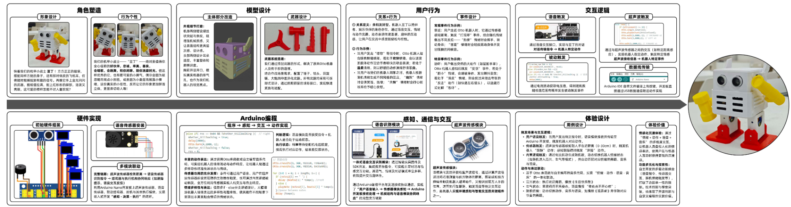
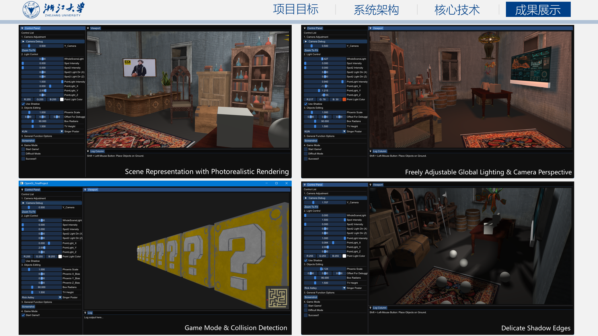

# Welcome to Computboy's Personal Website

## About Me

I am an undergraduate student majoring in **Industrial Design** at the **College of Computer Science and Technology, Zhejiang University**.  
My work focuses on the intersection of **computation, intelligent systems, Human-Computer Interaction**, with my particular interests in **Computer Graphics**, **Computer Vision**, and **Artificial Intelligence**.

I am especially interested in building interactive systems that combine **visual computing**, **geometric understanding**, and **learning-based methods**, aiming to create digital experiences that are both technically robust and visually expressive.

### Research Interests

- **Computer Graphics & Real-Time Rendering**  
  Rendering pipelines, lighting and shadowing, material appearance, real-time scene construction, and interactive 3D systems.

- **Computer Vision & 3D Visual Understanding**  
  Image understanding, scene perception, geometric reasoning, 3D reconstruction, and vision-based interaction.

- **Artificial Intelligence for Visual Computing**  
  Deep learning for graphics and vision, generative models, multimodal understanding, and intelligent interactive systems.

- **Human-Centered Intelligent Product Design**  
  Designing products and interfaces that integrate embedded systems, perception, and intelligent behaviors.

---

## Education

- **Zhejiang University** | B.Eng. in Industrial Design *(2024 – Present)*

  **Relevant Coursework:**  
  Computer Graphics, Data Structures and Algorithms, Design Thinking, Fundamentals of Intelligent Design

---

## Projects

### 01 | Companion Robot for Children

#### **Project Goal:**
Redesigned the original Otto Basic platform into a companion-oriented interactive robot for children, with a focus on friendlier form, expressive behavior, and responsive interaction.

#### **Methods and Process:**
Conducted user and market research, redesigned the robot’s appearance and structure, and developed the embedded control system based on Arduino Nano.
The project emphasized form control, motion behavior programming, and basic embedded development, including sensor reading, command parsing, state switching, and module coordination.
It also established a complete interaction chain: user instruction input → multi-level sensing → onboard program response → corresponding module output, integrating perception, communication, and interaction into one coherent system.

#### **Outcome:**
Built an interactive toy robot prototype supporting voice interaction and ultrasonic distance sensing, capable of generating different motion and feedback behaviors under different interaction contexts.
Its main strength lies in the relatively complete end-to-end pipeline from input, sensing, and processing to response output, making the robot more engaging and adaptive than conventional toys in a similar category.

---

### 02 | OpenGL-Based Real-Time 3D Scene Rendering Editor

#### **Project Goal:**  
Designed and implemented a lightweight 3D scene editing and rendering system (a mini editor / mini engine) for course projects and demonstration purposes.  
The system was intended to support:

1. Scene construction and interactive editing within one program, including object placement, transformation, and parameter adjustment;  
2. A stable **real-time rendering viewport** with basic camera navigation;  
3. Visually convincing rendering effects such as lighting, shadows, materials, and textures while maintaining a clear and extensible system structure.

#### **Technical Approach:**  

1. **Language and Graphics API:**  
    Built in **C++** with **OpenGL** as the rendering backend, and implemented core visual effects using **GLSL shaders**, including per-pixel lighting, texture sampling, and shadow sampling.

2. **Editor Interface System:**  
    Used **ImGui Docking** to build a multi-panel editor workflow, separating control panels, rendering viewport, and information/log windows.

3. **Resource and Rendering Architecture:**  
    Organized the system with layered **Model/Mesh abstractions**; used **Assimp** to load external mesh assets such as OBJ models; managed geometry data with **VAO/VBO**; and encapsulated texture binding and rendering states to improve robustness.

4. **Interaction and Playability:**  
    Added mouse-based interaction inside the viewport, including voxel placement and basic collision logic, enabling a simple explorable 3D maze-like scene.

#### **Outcome:**

Completed a functional prototype of a 3D scene editor with a full workflow from **scene construction** to **parameter tuning** and **visual presentation**:

1. **Scene Content:**  
    Supports both procedural voxel geometry generation (cube, sphere, cylinder, etc.) and external OBJ model import with multi-mesh rendering.

2. **Rendering Capability:**  
    Supports materials and textures, while allowing real-time adjustment of light sources and rendering parameters to observe changes in appearance directly.

3. **Application Value:**  
    The system can be used for graphics education, rendering pipeline demonstrations, assignment presentations, and rapid prototyping.  
    It also provides a foundation for future expansion toward a more complete editor, simulation tool, or small game framework.

---

## Notes and Technical Writing

### Fundamentals of Intelligent Design

In this section, I share my study notes from the course **Fundamentals of Intelligent Design** at Zhejiang University, with an emphasis on how AI methods can be applied in design and visual computing contexts.

The topics include:

1. **Python Fundamentals and Practical Computing for AI**

    - Basic Python syntax, variables, functions, object-oriented programming, and debugging
    - Practical tools commonly used in machine learning, such as **NumPy**, **Pandas**, **Matplotlib**, and **PyTorch**

2. **Foundations of Artificial Intelligence**

    - The origins, paradigms, and historical development of AI
    - Introductory concepts in generative AI, including **tokens**, **embeddings**, and representation learning
    - The role of AI in computational design and interactive systems

3. **Machine Learning and Deep Learning Basics**

    - Classical methods such as decision trees, K-Means clustering, SVM, logistic regression, and linear regression
    - Model evaluation and optimization strategies, including overfitting, underfitting, regularization, and data augmentation
    - Neural networks, CNNs, activation functions, and gradient-based optimization

4. **Generative Models**

    - Core ideas behind **VAE**, **GAN**, **Diffusion Models**, and **Flow Matching**
    - Their applications in image, audio, and content generation

5. **Agent Systems and Collaboration**

    - Basic concepts of intelligent agents
    - Agent architectures and collaborative workflows

In the long term, I hope to connect these foundations with research problems in **graphics, vision, and AI**, especially in areas such as **3D understanding**, **rendering-aware learning**, **generative visual content**, and **interactive intelligent systems**.

---

## Skills

- **Graphics & Programming:** OpenGL, GLSL, C++, Python, HTML, CSS  
- **AI & Data Analysis:** PyTorch (basic), Scikit-learn, NumPy, Pandas, Matplotlib  
- **Prototyping & Hardware:** 3D printing, embedded system development and debugging
- **Design Tools:** Adobe Photoshop, Illustrator, XD, Rhino, KeyShot, Figma

---

## Contact

- **Email:** wel_sun@zju.edu.cn  
- **GitHub:** github.com/Computboy

*Last updated: March 2026*

© 2026 Computboy. All rights reserved.