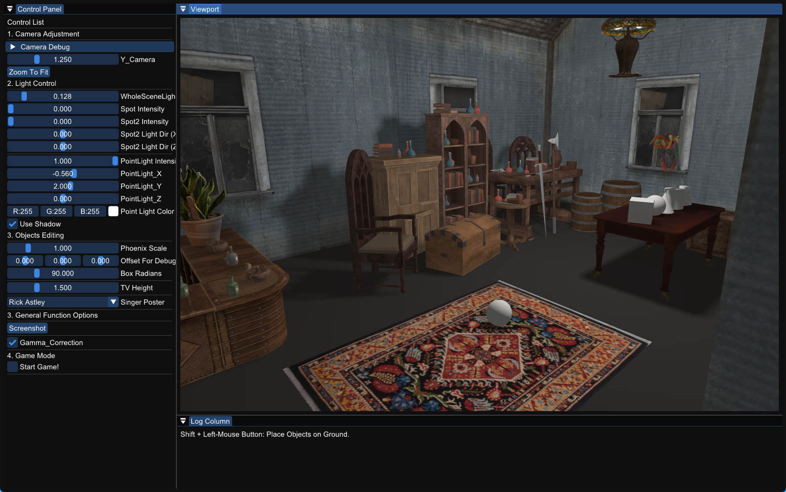
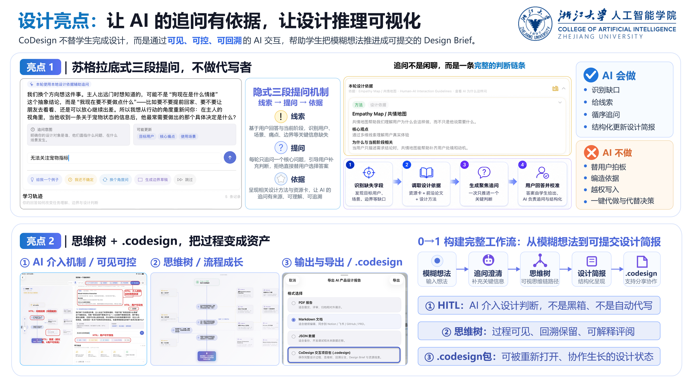
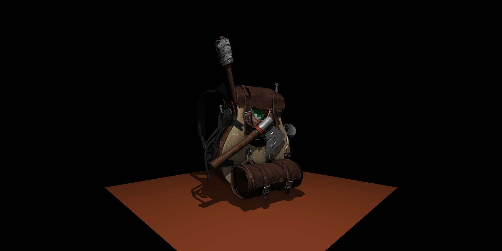
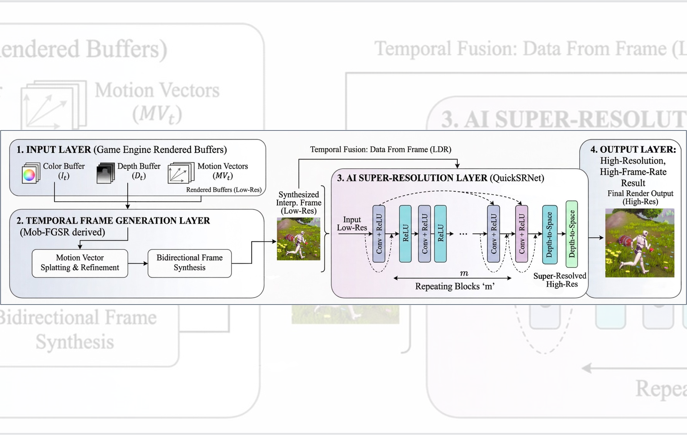

---
hide:
  - toc
---

# Graphics, Agents, and Creative Systems

I build interactive systems that connect real-time graphics, AI agents, and creative workflows.

[View Projects](projects/index.md){ .md-button .md-button--primary }
[Read Notes](notes/index.md){ .md-button }

## Selected Projects

<article class="project-card" markdown>

### [Realtime 3D Scene Editor](projects/realtime-3d-scene-editor.md)

Editor-style control for real-time scene manipulation.

OpenGLRealtime RenderingImGui DockingScene Graph

[View project →](projects/realtime-3d-scene-editor.md){ .card-link }

</article>

<article class="project-card" markdown>

### [CoDesign Agent](projects/codesign-agent.md)

An iOS workspace for traceable, structured project briefs.

SwiftUISwiftDataLLM APIStructured Extraction

[View project →](projects/codesign-agent.md){ .card-link }

</article>

<article class="project-card" markdown>

### [Tiny Software Rasterizer](projects/tiny-software-rasterizer.md)

A CPU renderer built from first principles.

C++RasterizationShadow MappingSSAO

[View project →](projects/tiny-software-rasterizer.md){ .card-link }

</article>

<article class="project-card" markdown>

### [Mobile SR & Frame Interpolation](projects/mobile-sr-frame-interpolation.md)

Mobile frame generation with neural super-resolution.

Mobile AIFrame GenerationSuper ResolutionSRTP

[View project →](projects/mobile-sr-frame-interpolation.md){ .card-link }

</article>

## Notes

[**Algorithms** Data structures and problem-solving patterns.](notes/algorithms/index.md)

[**Graphics** Rendering foundations, OpenGL, and pipeline notes.](notes/graphics/index.md)

[**AI** Vision, machine learning, and generative models.](notes/ai/index.md)

[**HCI** Interaction design and human-centered systems.](notes/hci/index.md)

